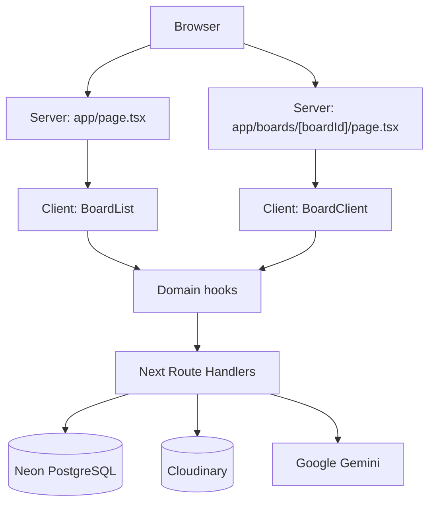
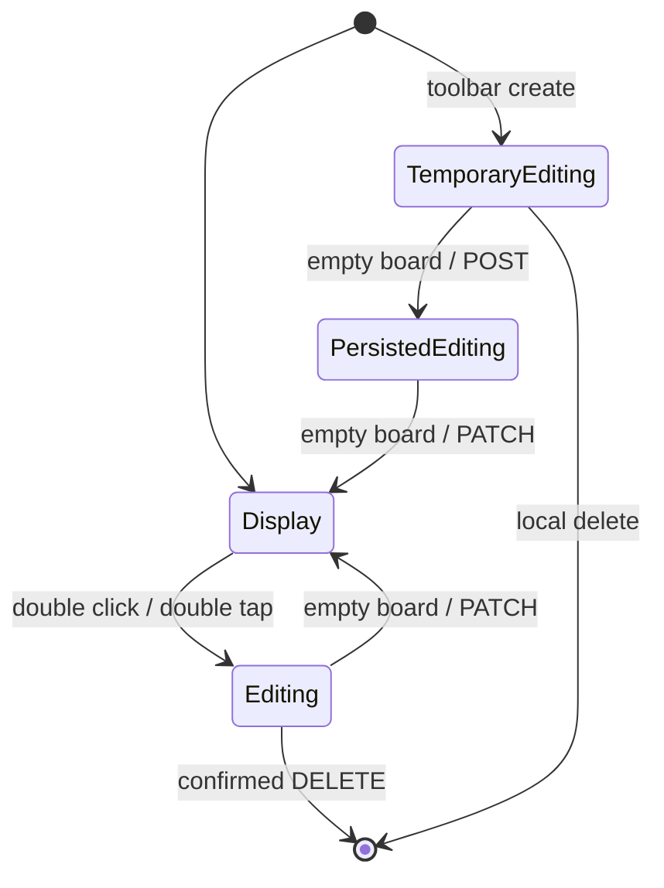

# Meldrift 기본설계서

작성 기준: 2026-08-21 현재 워크스페이스 구현

이 문서는 기존 `meldrift-detailed-design.md`의 시스템 설계와 `drawing-basic-design.md`의 드로잉 설계를 합친 Meldrift 기준 문서다. 컴포넌트 내부 구현은 [상세설계 폴더](./detailed-design/)에서 관리한다.

## 1. 목적과 범위

Meldrift는 큰 보드 위에 메모, 이미지, Mermaid 다이어그램, 표와 자유 드로잉을 배치하는 개인용 시각 정리 도구다.

- 보드 생성, 이름 변경, 삭제
- 카드 생성, 편집, 이동, 크기 조절, 삭제
- 카드 레이어 순서 변경
- 메모 검색과 연번 기반 탐색
- 메모 순서 변경
- Apple Pencil, 터치, 마우스 기반 자유 드로잉
- 카드 배치를 Markdown 문서로 컴파일하고 다운로드
- 로그인, 관리자 승인 기반 편집 권한
- AI 어시스턴트로 카드 생성·수정·삭제·재배치와 사용법 안내
- 프로젝트 정보와 외부 링크 안내

드로잉은 카드가 아니다. 하나의 보드에 속한 획 목록을 보드 전체 SVG 레이어에서 렌더링하며 Markdown 컴파일 대상에 포함하지 않는다.

## 2. 기술 구성

| 영역 | 기술 |
| --- | --- |
| 애플리케이션 | Next.js 16 App Router, React 19, TypeScript |
| 스타일 | Tailwind CSS 4, 전역 CSS |
| 데이터베이스 | Neon PostgreSQL, Drizzle ORM |
| 인증 | 난수 세션 토큰의 SHA-256 해시와 만료 시각, HttpOnly 쿠키, scrypt 비밀번호 해시 |
| 카드 이동 | `react-rnd` |
| 메모 편집 | TipTap StarterKit, Highlight, HardBreak |
| 이미지 | Cloudinary, Next Image |
| 보드 미리보기 | html-to-image, Canvas, Cloudinary |
| 다이어그램 | Mermaid, Mermaid ZenUML 플러그인 |
| 표 | TanStack Table |
| Markdown | Turndown, React Markdown, remark-gfm |
| AI 어시스턴트 | Google Gen AI SDK(Gemini), function calling, 모델 폴백 |
| 검증 | Zod 및 API별 수동 검증 |
| 테스트 | Vitest, Testing Library, Playwright |

## 3. 시스템 구조



서버 컴포넌트는 초기 데이터를 조회한다. 클라이언트 컴포넌트는 전달받은 데이터를 편집 가능한 로컬 상태로 보유하며 Route Handler를 통해 영속화한다.

## 4. 화면 진입

### 4.1 보드 목록 `/`

1. `app/page.tsx`가 보드를 ID 오름차순으로 조회한다.
2. `app/page.tsx`가 각 보드의 고정 Cloudinary 미리보기 URL을 조립한다.
3. `BoardList`가 정적 미리보기 이미지, 생성 카드와 개별 액션 메뉴를 렌더링한다.
4. 일반 사용자는 보드 열람만 가능하다.
5. 관리자만 보드 생성, 이름 변경, 삭제를 실행할 수 있다.

### 4.2 보드 `/boards/[boardId]`

1. 서버 페이지가 보드와 네 카드 컬렉션, 드로잉 획을 조회한다.
2. DB 필드명을 화면 모델의 `id` 형태로 매핑한다.
3. `BoardClient`가 초기 컬렉션을 전용 훅에 전달한다.
4. 카드와 드로잉은 같은 보드 좌표계에서 렌더링된다.
5. `boardId`가 양의 정수가 아니거나 조회된 보드가 없으면 `notFound()`를 호출해 Next.js 404 화면으로 전환한다. 카드 조회는 보드 존재 확인 뒤에만 실행한다.

## 5. 프론트엔드 계층

```text
BoardClient
├── BoardMenu
├── BoardToolBar
│   ├── BoardZoomControl
│   └── card-tool-portal
├── BoardSearchPanel
├── BoardNavigator
├── MemoReorderPanel
├── BoardMarkdownView
├── AboutModal
├── SignInModal / SignUpModal
├── AiAssistantButton
├── AiChatPanel
├── BoardMessage
├── MemoCard[] / MemoEditor / MemoToolBar
├── ImageCard[] / ImageToolBar
├── MermaidCard[] / MermaidToolBar
├── TableCard[] / TableGrid / TableToolBar
└── DrawingLayer / DrawingToolBar
```

`BoardClient`는 화면 조정 허브다. 컬렉션, 현재 편집 ID, 인증, 줌, 보드 스크롤, 검색, 탐색, 레이어 변경과 드로잉 모드를 연결한다. 카드 내부 초안과 포인터 처리는 각 카드 훅이 담당한다.

`AboutModal`은 `BoardMenu`의 About 항목으로 열리며 `document.body`에 포탈로 렌더링한다. 외부 링크는 새 탭으로 연다.

`BoardMessage`는 권한 메시지와 메모 메시지를 화면 상단에 표시하고 3500ms 후 자동으로 닫는다. 메시지가 빈 문자열이면 아무것도 렌더링하지 않는다.

## 6. 상태 소유권

| 상태 | 소유자 |
| --- | --- |
| 인증 사용자, 로그인/가입 모달 | `useBoardAuth` |
| 카드 컬렉션과 편집 카드 ID | `useBoardMemos`, `useBoardImages`, `useBoardMermaids`, `useBoardTables` |
| 카드 내부 초안 | `useMemoCard`, `useImageCard`, `useMermaidCard`, `useTableCard` |
| 메모 검색과 포커스 | `useBoardSearch`, `useBoardMemoFocus` |
| 메모 순서 패널과 끌기 상태 | `useMemoReorder` |
| 보드 메뉴, About, Markdown, 탐색 패널 열림 | `BoardClient` |
| 검색 패널, 검색어, 결과와 현재 인덱스 | `useBoardSearch` |
| 보드 줌 | `useBoardZoom` |
| 보드 패닝과 편집 입력 보호 | `useBoardScroll` |
| 레이어 변경 | `useCardLayer` |
| 드로잉 컬렉션과 도구 | `useBoardDrawing` |
| 현재 획과 포인터 소유권 | `useDrawingPointer` |
| 보드 미리보기 캡처와 업로드 예약 | `useBoardPreview` |
| AI 채팅, 사용 가능 여부, 미저장 생성·수정·삭제·이동 | `useAiAssistant` |

`editingMemoId`, `editingImageId`, `editingMermaidId`, `editingTableId` 중 하나가 존재하거나 드로잉 모드이면 일반 보드 툴바를 숨긴다.

## 7. 보드 좌표와 확대

```text
.board-scroll-layer     실제 스크롤 컨테이너
└── .board-size-layer   확대된 전체 스크롤 크기 보장
    └── .meldrift-board 논리 보드, transform: scale(boardZoom)
```

- 카드의 `x`, `y`, `width`, `height`는 확대 전 보드 좌표다.
- `x`, `y` 기준은 카드의 왼쪽 위다.
- 화면 중앙 자동 배치는 다음 식을 사용한다.

```text
x = (scrollLeft + clientWidth / 2) / zoom - cardWidth / 2
y = (scrollTop  + clientHeight / 2) / zoom - cardHeight / 2
```

- 결과 좌표는 0 이상으로 제한하고 저장 전에 반올림한다.
- `react-rnd`에는 `scale={zoom}`을 전달한다.

## 8. 공통 카드 생명주기



### 8.1 임시 카드

- 툴바에서 한 장씩 만드는 임시 카드는 `-Date.now()`를 ID로 사용한다. AI가 여러 장을 한 번에 만들 때는 `-Date.now()`를 시작값으로 두고 1씩 증가시켜 중복을 피한다.
- 현재 화면 중앙에 생성하고 즉시 편집 상태로 만든다.
- 저장 시 POST 후 서버 ID를 받은 카드로 교체한다.
- 임시 카드 삭제는 API 없이 로컬 컬렉션에서 제거한다.

| 카드 | 기본 크기 | 최소 크기 |
| --- | --- | --- |
| Memo | 300 x 200 | 180 x 180 |
| Image | 원본 비율 유지, 최대 400 x 300 | 48 x 48 |
| Mermaid | 480 x 360 | 180 x 180 |
| Table | 560 x 360 | 360 x 128 |

최소 크기는 `react-rnd`의 `minWidth`, `minHeight`로 적용한다. 이미지는 작은 아이콘 배치를 허용하기 위해 다른 카드보다 낮은 하한을 사용한다.

### 8.2 편집과 외부 저장

- 데스크톱은 더블 클릭, 터치는 300ms 이내 더블 탭으로 편집한다.
- 편집 카드는 `ACTIVE_CARD_Z`를 임시 z-index로 사용한다.
- 편집 중에만 이동과 크기 조절을 허용한다.
- 메모, Mermaid, 표는 보드 빈 영역에서 시작하고 끝난 포인터 입력만 저장으로 인정한다.
- 카드 내부 드래그가 바깥에서 끝나는 경우는 시작 지점 Ref로 저장을 막는다.
- 이미지는 현재 `pointerup` 대상만 판정하고 `setTimeout(..., 0)`으로 다음 이벤트 루프에서 저장한다.
- `.board-toolbar`와 `.confirm-dialog`는 외부 저장 대상에서 제외한다.

## 9. 카드별 데이터

### 9.1 Memo

- `content`: TipTap HTML
- `color`: 배경색, 신규 메모 기본값은 Yellow `#fffadc`
- 색상은 Yellow, Pink, Blue, Green, Lavender, Peach, Mint, Gray 8종을 제공한다.
- 도구: 색상, H1-H6, 굵게, 기울임, 취소선, 강조, 구분선, 코드 블록, 인용
- 도구는 main, format, block 세 모드로 나누어 표시하고 모드 전환 시 열린 팝업을 닫는다.
- 읽기 상태는 HTML을 직접 렌더링한다.

### 9.2 Image

- 사용자가 직접 선택한 이미지는 브라우저에서 PNG로 재인코딩한다.
- 긴 변을 최대 2000px로 줄이고, 4MiB 이하가 될 때까지 가로·세로를 85%씩 축소한다. 변환 실패 시에는 원본 파일로 폴백한다.
- 임시 미리보기는 Object URL을 사용하고 교체 또는 삭제 시 해제한다.
- 서버는 Cloudinary의 `publicId`와 `secureUrl`을 저장한다.

### 9.3 Mermaid

- `source`: Mermaid 문법 문자열
- 편집 중 textarea와 실시간 SVG 미리보기를 함께 표시한다.
- 렌더 ticket과 고유 ID로 오래된 비동기 결과를 폐기한다.
- SVG 고정 크기를 제거하고 `preserveAspectRatio`를 적용한다.
- ZenUML이 삽입하는 Tailwind 충돌 전역 스타일은 렌더 후 제거한다.

### 9.4 Table

- `source`: JSONB `TableSource`
- 최소 구조는 열 1개와 행 1개다.
- 셀 입력, 열 이름 변경, 행/열 추가, 행 선택 삭제, 열 삭제, 열 크기 변경을 제공한다.
- 정렬, 필터, 페이지네이션은 사용하지 않는다.
- 비편집 상태에도 도구 영역을 유지하고 비활성·연회색으로 표시한다.
- 셀 입력과 표시 모두 셀 너비 안에서 자동 개행한다.

## 10. 툴바와 레이어

`BoardToolBar`는 오른쪽 하단에 일반 도구와 `card-tool-portal` 대상 노드를 제공한다. 편집 중인 카드의 전용 툴바는 `CardToolPortal`을 통해 같은 위치에 렌더링된다. 줌 컨트롤은 항상 유지된다.

```text
일반 카드 z             DB z 값
편집 카드 z             ACTIVE_CARD_Z = 49999
드로잉 SVG z            ACTIVE_CARD_Z - 1
보드 메뉴/툴바 z        50000
AI 어시스턴트 버튼/패널 z 50000
BoardMenu 드롭다운 z    50001
Markdown 모달 z         60000 / 60001
```

Bring to Front는 전체 카드의 최대 `z + 1`을 사용한다. Send to Back은 선택 카드를 1로 만들고 나머지 카드의 z를 증가시킨다. 최대 z가 9000 이상이면 타입, 기존 z, ID 순으로 1부터 정규화한다.

## 11. 메모 검색과 탐색

`BoardToolBar`는 메모 탐색과 메모 검색 패널을 제공한다. 두 패널은 상호 배타적이며 하나를 열면 다른 하나와 보드 메뉴를 닫는다. 두 패널 모두 `fixed bottom-20 left-1/2` 위치에 표시한다.

두 기능은 `useBoardMemoFocus`의 포커스 동작을 공유한다. 포커스는 대상 메모를 `scrollIntoView`로 화면 중앙에 맞추며, 보드 진입 후 메모가 존재하면 첫 메모를 한 번 자동 포커스한다.

탐색 연번과 검색 결과 순회는 모두 메모의 `sort_order` 오름차순을 따른다. 같은 값이면 ID 오름차순이다. 순서를 바꾸지 않은 보드에서는 생성 순서와 같다.

### 11.1 메모 탐색

`BoardNavigator`는 메모를 `sort_order` 오름차순으로 정렬한 순서를 1부터 시작하는 연번으로 표시한다.

- 구성은 이전 버튼, 연번 입력, 전체 메모 수, 다음 버튼 순서다.
- 연번 입력은 숫자 이외의 문자를 제거하고 값이 있으면 즉시 이동한다.
- 유효 범위는 `1`부터 전체 메모 수까지이며 벗어나면 포커스를 유지하고 메모 메시지를 표시한다.
- 실제 포커스가 바뀌면 입력 표시값도 해당 연번으로 갱신한다.

### 11.2 메모 검색

`BoardSearchPanel`은 검색어를 포함하는 메모를 순회한다.

- 검색 대상은 메모의 `content` 문자열이며 대소문자를 구분하지 않는 부분 일치다.
- 이전과 다음은 결과 목록을 순환한다.
- 현재 위치와 전체 결과 수를 함께 표시하고 결과가 없으면 0을 표시한다.
- 결과가 없는 상태에서 이동을 시도하면 메모 메시지를 표시한다.

### 11.3 메모 순서 변경

`MemoReorderPanel`은 보드 메뉴의 `Reorder Memos` 항목으로 열고 닫는다. 화면 왼쪽 위에 고정하며 메모를 순서대로 한 줄씩 세운다. 한 번에 다섯 줄을 보여주고 나머지는 목록을 스크롤해서 본다.

- 줄은 손잡이, 연번, 메모 색, 본문 미리보기 순서다. 본문은 HTML을 걷어낸 한 줄이며 넘치는 부분은 말줄임표로 자른다.
- 순서 변경은 줄 왼쪽 손잡이에서만 시작한다. 나머지 영역은 목록 스크롤과 해당 메모로 이동하는 탭에 쓴다.
- 4px 임계값을 넘지 않고 끝난 입력은 끌기가 아니라 누른 것으로 보고 그 메모를 포커스한다.
- 끄는 동안 `pointermove`와 `pointerup`을 `window`에서 듣는다. 미리보기로 줄의 DOM 순서가 바뀌면 포인터 캡처를 잃을 수 있고, 패널 밖으로 나간 입력도 놓친다.
- 끌고 있는 줄만 손가락을 따라 `translateY`로 움직이고 나머지 줄은 자리를 비켜 준다. 화면 순서는 놓기 전까지 미리보기이며 저장은 놓는 순간 한 번만 한다.
- 줄의 위쪽 끝이 다음 칸의 절반을 넘어서면 그 자리를 넘겨받는다.
- 편집 권한이 없으면 끌기를 시작하지 않고 권한 메시지를 표시한다. 저장 전 임시 카드는 음수 ID라 순서를 바꿀 수 없다.

화면은 놓는 즉시 바꾸고 서버에는 그 뒤에 알린다. 응답을 기다렸다가 반영하면 놓은 줄이 잠깐 원래 자리로 돌아갔다가 다시 움직인다. 화면과 서버가 같은 순수 함수로 계산하므로 성공하면 두 결과가 같고, 서버가 거절하거나 요청이 실패하면 순서 값만 원래대로 되돌린다. 되돌릴 때 그 사이에 바뀐 본문이나 좌표는 건드리지 않는다.

클라이언트는 `POST /api/memos/order`에 옮길 메모와 놓을 자리만 보낸다. 순서 값은 서버가 정한다.

- 서버는 보드의 메모를 `sort_order`, `id` 순으로 읽어 그 값으로 새 순서를 계산한다.
- 옮기는 메모의 `sort_order`를 목적지 값으로 바꾸고, 원래 자리와 목적지 사이에 낀 메모만 +1 또는 -1 한다. 나머지 메모는 건드리지 않는다.
- 바뀐 행만 모아 `UPDATE ... FROM (VALUES ...)` 한 문장으로 쓴다. 재정렬 한 번에 조회 1회, 쓰기 1회다.
- 삭제로 생긴 빈 번호가 있어도 상대 순서만 보므로 결과가 같고 값의 유일성도 유지된다.

여기서 정한 순서가 곧 Markdown 문서 순서다. 카드를 보드에서 옮기는 것으로는 문서 순서가 바뀌지 않는다.

## 12. 보드 패닝과 입력 보호

- 마우스 왼쪽 버튼만 패닝을 시작한다.
- 160ms 이상 누르고 5px 이상 이동한 뒤 실제 패닝으로 전환한다.
- 편집 카드, 드로잉 캡처 레이어, 툴바, 다이얼로그, 입력 요소에서는 시작하지 않는다.
- 카드 편집 중 방향키 또는 텍스트 선택 드래그가 부모 보드를 스크롤하면 저장한 좌표로 복원한다.
- 패닝 중에는 `documentElement.dataset.boardPanning`을 설정하고 종료 후 정리한다.

## 13. 드로잉

### 13.1 데이터와 좌표

보드마다 `drawings` 행 하나를 유지하며 `source` JSONB에 획 배열 전체를 저장한다.

```ts
type StrokePoint = [number, number];
type BoardStroke = {
    id: string;
    color: string;
    width: number;
    points: StrokePoint[];
};
```

```text
boardX = (clientX - svgRect.left) / zoom
boardY = (clientY - svgRect.top) / zoom
```

획은 첫 점에서 시작해 각 중간 점과 다음 점의 중점을 잇는 quadratic Bézier path로 변환하고, 끝 점까지 선분으로 연결한다. path는 둥근 cap/join으로 표시한다.

### 13.2 도구

| 도구 | 입력 | 동작 |
| --- | --- | --- |
| draw | SVG 캡처 | 현재 획 미리보기 후 pointer 종료 시 추가 |
| erase | SVG 캡처 | 포인터 경로와 획 선분 거리로 부분 삭제 |
| pan | 통과 | 드로잉 캡처 해제 |

펜 색상은 Ink, Red, Yellow, Green, Sky, Blue, Purple 7종이며 기본값은 Ink `#1f2937`이다. 굵기는 Thin 2, Medium 4, Bold 8이며 기본값은 Medium이다. 색상과 굵기 팝업은 상호 배타적이다.

erase와 pan은 토글이며 같은 도구를 다시 누르면 draw로 되돌아간다. 색상과 굵기는 이후 그리는 획에만 적용하고 기존 획은 변경하지 않는다.

드로잉 모드가 꺼져도 저장된 획은 남지만 `pointer-events: none`이다. 모드 전환 시 `DrawingLayer`의 key를 바꿔 포인터 상태를 초기화한다.

### 13.3 펜과 팜 리젝션

- 펜 입력 시작 시 펜 접촉 상태를 기록하고 비펜 입력을 무시한다.
- 터치가 먼저 시작된 상태에서 펜이 오면 기존 입력을 폐기하고 펜에 소유권을 넘긴다.
- 비주 포인터 터치는 무시한다.
- 펜 up/cancel 또는 pressure와 buttons가 없는 hover에서 접촉 상태를 해제한다.
- 해제 후 드로잉 모드를 다시 켜지 않아도 터치 입력이 가능하다.

브라우저가 손바닥과 펜을 보고하는 순서는 장치와 Safari에 의존하므로 네이티브 수준의 완전한 팜 리젝션은 보장하지 않는다.

### 13.4 지우개와 저장

- 지우개 화면 반지름은 줌으로 나눠 보드 좌표 반지름으로 바꾼다.
- 커서는 흰 내부색과 회색 테두리 원이다.
- 지우개 이동 구간과 획 선분 사이의 거리를 계산해 반경 안의 선분을 제거한다.
- 획 추가, 삭제, undo는 미저장 상태를 설정한다.
- 완료 버튼으로 모드를 끝낼 때 변경이 있으면 전체 획 배열을 PATCH한다.

## 14. 보드 미리보기

보드 목록은 보드 페이지를 다시 실행하는 `iframe` 대신 Cloudinary에 저장된 정적 WebP 이미지를 사용한다.

1. 카드 INSERT/UPDATE 또는 드로잉 저장 성공 시 `schedulePreviewUpdate()`를 호출한다.
2. 500ms 동안 연속 요청을 합치고, 업로드 중 새 요청이 생기면 완료 후 한 번 더 캡처한다.
3. 두 번의 `requestAnimationFrame` 후 현재 `.board-scroll-layer` 뷰포트를 `html-to-image`의 Canvas로 캡처한다.
4. 보이는 이미지 카드는 DOM 캡처에서 제외한 뒤 원본 이미지를 Canvas에 직접 그려 CORS·복제 오차를 줄인다.
5. Canvas를 WebP로 변환해 `PUT /api/boards/[boardId]/preview`로 전송한다.
6. Cloudinary의 `meldrift/boards/{boardId}/PreviewIMG.webp`를 overwrite해 파일이 누적되지 않게 한다.

새 보드 또는 미리보기 로드에 실패한 보드를 열 때는 `sessionStorage`에 보드 ID를 기록한다. 해당 보드가 마운트되면 최초 미리보기 생성을 한 번 예약한다.

현재 삭제와 레이어 순서 변경은 미리보기 갱신 예약을 호출하지 않는다. 미리보기는 영속 데이터 자체가 아니라 목록 표시용 스냅샷이다.

## 15. Markdown 컴파일

`GET /api/boards/[boardId]/markdown`은 메모를 `sort_order`, `id` 순으로 정렬하고 각 메모 꼭짓점을 포함하는 이미지, Mermaid, 표 중 z가 가장 높은 카드를 선택한다.

```text
1: 좌상단   2: 우상단
3: 좌하단   4: 우하단
```

포함 판정은 카드 내부에 꼭짓점이 엄격히 들어오는 `<` 조건이다. 같은 카드가 여러 접점에서 선택되면 최종 Markdown에는 한 번만 출력한다.

| 원본 | Markdown |
| --- | --- |
| Memo HTML | Turndown |
| Image | `` |
| Mermaid | fenced `mermaid` 블록 |
| Table JSON | GFM 표 |

프리뷰는 Mermaid 블록을 분리해 공통 렌더러로 표시하고, 일반 섹션은 React Markdown + GFM + sanitize로 렌더링한다. 원문은 `.md` Blob으로 다운로드한다.

## 16. AI 어시스턴트

자연어 요청을 받아 카드를 만들고, 고치고, 지우고, 다시 배치한다. Meldrift 조작법 질문에도 답한다. 보드를 바꾸는 동작은 모두 사용자가 저장을 눌러야 반영된다.

지원 범위는 동작마다 다르다. 생성은 메모와 메모에 붙는 Mermaid·표·이미지를 지원하고, 내용 수정은 메모·Mermaid·표, 삭제는 네 카드 타입 전체, 재배치는 메모와 메모에 붙는 Mermaid·표를 지원한다. 기존 이미지의 내용 수정과 재배치는 지원하지 않는다.

이미지 카드는 사용자가 그림을 명시적으로 요청했을 때만 만든다. 재배치는 좌표만 바꾸므로 문서 순서를 바꾸지 못한다. 문서 순서는 메모의 `sort_order`이며 `MemoReorderPanel`에서만 바꾼다.

### 16.1 사용 조건

- Gemini API 키는 서버 환경변수 `AI_API_KEY` 하나를 쓴다. 배포 환경에서는 Vercel 프로젝트 설정에 넣으며 클라이언트로는 내려가지 않는다.
- 채팅 요청은 카드 편집과 같은 권한, 즉 로그인과 관리자 승인을 요구한다.
- 호출 비용은 서버 소유자의 Google 계정에 청구되므로, 승인 게이트가 곧 비용 통제 수단이다.

### 16.2 생성 흐름

1. 보드 메뉴 아래의 `AiAssistantButton`을 누르면 `GET /api/ai/status`로 사용 가능 여부를 확인한다.
2. 쓸 수 없으면 이유를 메시지로 띄우고, 쓸 수 있으면 화면 아래 `AiChatPanel`을 연다.
3. 요청을 `POST /api/ai/chat`으로 보낸다.
4. 서버는 `create_board_cards`, `rearrange_board_cards`, `edit_board_cards`, `delete_board_cards` 네 함수를 선언하고, 모델이 넘긴 인자를 zod로 다시 검증한다. 여러 개가 동시에 호출되면 지우기 > 고치기 > 재배치 > 생성 순으로 하나만 고른다.
5. 검증된 계획을 클라이언트가 임시 카드로 보드에 올린다. 이 시점까지 DB 쓰기는 없다.
6. 사용자가 저장을 누르면 메모, Mermaid, 표, 이미지 순서로 INSERT한다. 이어서 내용 수정, 삭제, 재배치 PATCH를 처리한다. 취소하면 생성 카드는 제거하고 수정·삭제·이동 카드는 원래 상태로 복원한다.

### 16.3 좌표를 모델에게 맡기지 않는다

Markdown 컴파일이 메모 꼭짓점 포함 여부로 카드를 고르므로 좌표가 조금만 어긋나도 문서 구조가 달라진다. 모델은 섹션 목록이라는 논리 구조만 만들고, 좌표는 `layoutBoardPlan`이 결정한다.

- 배치 방식은 모델이 `column`, `grid`, `tree`, `scatter` 중에서 고른다. 한 줄기 문서는 column, 대등한 항목 나열은 grid, 상위-하위 구조가 있는 설계는 tree, 순서 없는 브레인스토밍은 scatter다.
- `scatter`는 grid와 같은 칸을 쓰되 각 섹션을 자기 칸 안에서만 무작위로 흔든다. 칸을 벗어나지 않으므로 메모끼리 겹치지 않고, 칸 사이에 최소 간격도 남는다.
- `tree`는 깊이를 x축, 형제 순서를 y축으로 쓴다. 모델은 `parentIndex`로 상위 섹션만 지정하고 좌표는 지정하지 않는다.
- 메모 폭은 400 고정이고 높이는 내용에 맞춰 늘어난다. 블록별 줄 수로 추정해 200에서 1200 사이로 정하며, 한글은 반각 글자의 두 배 폭으로 세어 글이 카드 밖으로 넘치지 않게 한다.
- 첨부 카드는 해당 메모의 오른쪽 위 꼭짓점을 `attachmentOverlap`(24)만큼 겹쳐 감싼다.
- 다음 섹션까지의 간격은 `max(메모 높이, 첨부 높이 - 겹침) + sectionGap`(80)이다.
- `sectionGap`이 `attachmentOverlap`보다 크므로 첨부 카드가 같은 열 위쪽 메모의 꼭짓점을 덮지 않는다.
- 열 간격이 첨부 카드의 오른쪽 끝보다 크므로 옆 열 메모의 꼭짓점도 덮지 않는다.
- 카드는 보드 밖으로 나가지 않는다. 자리가 모자라면 그 섹션을 배치하지 않고 사용자에게 알린다.

이 관계가 깨지면 카드가 엉뚱한 메모에 붙는다. `tests/unit/ai-board-plan.test.ts`가 컴파일 SQL과 같은 판정식으로 검증한다.

### 16.4 메모 본문 생성

모델은 HTML을 만들지 않는다. `heading`, `paragraph`, `bulletList`, `orderedList`, `codeBlock`, `blockquote` 블록만 내놓고 `memoBlocksToHtml`이 이스케이프해 TipTap 호환 HTML로 바꾼다. 메모 표시 모드가 `dangerouslySetInnerHTML`을 쓰므로 이 경계가 XSS 방어선이다.

### 16.5 카드 고치기와 지우기

- 대상은 이미 저장된 카드뿐이다. 스키마가 ID를 양수로 제한해 임시 카드는 지목할 수 없다.
- 고치기는 부분 수정이 아니라 전체 교체다. 좌표와 크기는 건드리지 않는다.
- 지우기는 저장 전까지 화면에서만 사라지고, 취소하면 원본이 그대로 돌아온다.
- 현재 저장 구현은 생성 → 내용 수정 → 삭제 → 재배치 순서다. 한 AI 응답에서는 네 함수 중 하나만 선택하므로 보통 한 종류의 pending 작업만 존재한다.

### 16.6 이미지 생성

모델은 그림 바이트를 만들 수 없으므로 프롬프트만 내고, 서버가 이미지 모델을 따로 호출해 base64를 받는다. 클라이언트는 이를 File로 바꿔 임시 카드에 담고, Cloudinary 업로드는 저장을 누른 시점에만 일어난다. 한 번에 최대 3장이며 실패한 장은 건너뛰고 메모만 남긴다.

### 16.7 사용법 안내

`lib/ai/meldrift-guide.ts`가 조작법을 정리해 시스템 프롬프트에 붙는다. 조작법 질문에는 함수를 호출하지 않고 이 내용으로만 답하며, 없는 기능을 지어내지 않도록 제한한다. 조작 방식이 바뀌면 이 파일도 함께 고쳐야 한다.

### 16.8 저장 순서

문서 순서는 메모의 `sort_order` 순서다. 서버가 INSERT마다 그 보드의 `MAX(sort_order) + 1`을 매기므로, 임시 카드를 저장할 때 메모를 계획 순서대로 하나씩 INSERT해야 문서 순서가 계획 순서와 일치한다.

## 17. 인증과 권한

1. 로그인 성공 시 32바이트 난수를 base64url로 인코딩한 세션 토큰을 만든다.
2. 원문 토큰은 HttpOnly 쿠키에만 저장하고, DB에는 SHA-256 해시와 7일 만료 시각을 저장한다. 쿠키는 `SameSite=Lax`, 경로 `/`, 운영 환경에서만 `Secure`로 설정한다.
3. 같은 사용자가 다시 로그인하면 사용자 행의 세션 해시가 교체되어 이전 기기의 세션은 즉시 무효화된다.
4. API는 쿠키 형식을 검사하고 해시를 계산한 뒤 `session_token_hash` 일치와 `session_expires_at > now`를 동시에 만족하는 사용자를 조회한다.
5. 로그아웃은 현재 쿠키와 일치하는 DB 세션 해시·만료 시각을 null로 만들고 쿠키를 삭제한다.
6. `isApproved` 사용자만 카드와 드로잉을 편집할 수 있다.
7. 보드 생성, 이름 변경, 삭제는 `role === "admin"`을 요구한다.
8. 비밀번호는 랜덤 salt와 scrypt 결과를 `salt:hash`로 저장한다.

## 18. 데이터베이스

| 테이블 | 핵심 데이터 | 관계 |
| --- | --- | --- |
| `users` | email, password_hash, session_token_hash, session_expires_at, permission_flg, role | 독립 |
| `boards` | title, width, height, owner_id | 루트 |
| `memos` | HTML, color, x/y/z, size, sort_order | `board_id` 보유 |
| `images` | Cloudinary ID/URL, x/y/z, size | `board_id` 보유 |
| `mermaids` | source, x/y/z, size | `board_id` 보유 |
| `tables` | source JSONB, x/y/z, size | `board_id` 보유 |
| `drawings` | 보드별 획 배열 JSONB | `board_id` unique |

`memos.sort_order`는 보드 안에서만 의미가 있으므로 `(board_id, sort_order)` 인덱스를 둔다. 새 메모는 그 보드의 `MAX(sort_order) + 1`을 받는다.

현재 스키마는 카드·드로잉의 `board_id`에 외래키를 두지 않는다. 보드 삭제 API가 DB 이미지 원본과 고정 미리보기 `PreviewIMG`를 Cloudinary에서 먼저 삭제하고 `images`, `memos`, `mermaids`, `drawings`, `tables`, `boards` 순서로 관련 행을 명시적으로 삭제한다.

## 19. API 목록

| Method | Path | 역할 |
| --- | --- | --- |
| GET | `/api/me` | 현재 사용자 |
| POST | `/api/signin`, `/api/signup`, `/api/signout` | 인증 |
| POST | `/api/boards` | 보드 생성 |
| PATCH/DELETE | `/api/boards/[boardId]` | 이름 변경, 보드 삭제 |
| POST | `/api/memos`, `/api/images`, `/api/mermaids`, `/api/tables` | 카드 생성 |
| PATCH/DELETE | `/api/{cardType}/[id]` | 카드 수정, 삭제 |
| POST | `/api/memos/order` | 메모 순서 변경 |
| POST | `/api/cards/layer` | 레이어 이동과 정규화 |
| GET/PATCH | `/api/drawings/[boardId]` | 획 조회, 전체 교체 |
| GET | `/api/boards/[boardId]/markdown` | Markdown 컴파일 |
| PUT | `/api/boards/[boardId]/preview` | 보드 미리보기 WebP 덮어쓰기 |
| GET | `/api/ai/status` | AI 어시스턴트 사용 가능 여부 |
| POST | `/api/ai/chat` | AI 어시스턴트 대화와 카드 계획 생성 |

## 20. 테스트와 CI

- Vitest는 훅·유틸리티·API 계약과 서버 페이지 분기를 검증한다.
- Playwright는 Desktop Chromium, iPhone WebKit, iPad WebKit에서 읽기 중심 사용자 흐름을 검증한다.
- GitHub Actions는 `main` 대상 Pull Request와 수동 실행에서만 동작한다.
- 실행 순서는 `npm ci` → ESLint → TypeScript → Vitest → Next.js build → Playwright다.
- CI에는 `NEON_CONNECTION_STRING` secret이 필요하다. `E2E_BOARD_ID`가 없으면 목록의 첫 보드를 사용하며, CI에서 보드가 하나도 없으면 데이터 의존 테스트를 skip하지 않고 실패시킨다.
- 실패 여부와 관계없이 Playwright HTML report를 artifact로 보관한다.

## 21. 변경 원칙

- 새 카드 종류는 DB, 서버 조회, BoardClient 컬렉션, CRUD API, 레이어 API, Markdown 컴파일을 함께 검토한다.
- 보드 좌표는 DB와 카드 로컬 상태 모두 확대 전 기준을 유지한다.
- 전역 pointer listener에는 제외 영역 판정과 cleanup을 함께 정의한다.
- 비동기 INSERT가 임시 ID를 실제 ID로 교체하는 흐름을 유지한다.
- 드로잉 입력은 pen, touch, mouse와 draw, erase, pan 조합을 각각 검증한다.
- 카드·드로잉의 영속 상태를 바꾸는 흐름은 보드 미리보기 갱신 필요 여부를 함께 검토한다.
- 카드 배치 상수나 컴파일 접점 규칙을 바꾸면 `layoutBoardPlan`의 배치 관계도 함께 검토한다.
- 모델이 만든 문자열은 어떤 경로로도 HTML로 신뢰하지 않는다.
